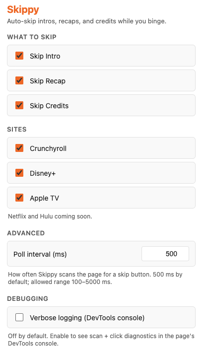

# Skippy-FF

[](https://github.com/synle/skippy-ff/actions/workflows/build-main.yml)

Auto-skip intros, recaps, and credits while you binge. SponsorBlock for streaming services.

Currently supports **Crunchyroll**, **Disney+** (also covers **Hulu** — Hulu's catalog now streams through the Disney+ player after the catalog merger), **Apple TV**, **Netflix**, **Prime Video**, **Max** (HBO Max), **Paramount+**, **Peacock**, **Tubi**, **AMC+**, and **Shudder**.

## How it works

A content script runs on supported streaming sites. It polls for visible skip buttons — matched by `aria-label`, `data-uia`, `data-testid`, or normalized button text (case-insensitive, whitespace-collapsed) depending on the site — and clicks them automatically. A per-button cooldown prevents double-clicks. Each skip type is a flag — toggle them in the popup.

## Install (unpacked, for development)

```bash
npm install
npm run build
```

1. Open Chrome → `chrome://extensions/`
2. Enable **Developer mode**
3. **Load unpacked** → select the `dist/` folder
4. Pin the extension to your toolbar (puzzle icon → pin Skippy-FF) for quick access to settings

## Scripts

| Command           | Purpose                            |
| ----------------- | ---------------------------------- |
| `npm run build`   | Copy `src/` + `public/` to `dist/` |
| `npm run bundle`  | Zip `dist/` into `skippy-ff.zip`   |
| `npm run package` | Build + bundle                     |
| `npm run format`  | Prettier (140 char width)          |

## Project structure

```
skippy-ff/
├── src/
│   ├── manifest.json                  # MV3 manifest
│   ├── helpers/storage.js             # chrome.storage.sync wrapper
│   ├── content/
│   │   ├── skippy-core.js             # visibility + click helpers, polling loop
│   │   ├── skippy-crunchyroll.js      # Crunchyroll site adapter
│   │   ├── skippy-disneyplus.js       # Disney+ site adapter
│   │   ├── skippy-appletv.js          # Apple TV site adapter
│   │   ├── skippy-netflix.js          # Netflix site adapter
│   │   ├── skippy-primevideo.js       # Amazon Prime Video site adapter
│   │   ├── skippy-max.js              # Max (HBO Max) site adapter
│   │   ├── skippy-paramountplus.js    # Paramount+ site adapter
│   │   ├── skippy-peacock.js          # Peacock site adapter
│   │   ├── skippy-tubi.js             # Tubi site adapter
│   │   └── skippy-amcplus.js          # AMC+ / Shudder site adapter (shared JW Player stack)
│   └── pages/options/                 # Settings page (also used as popup)
│       ├── options.html
│       ├── options.css
│       └── options.js
├── public/icon.png                    # Extension icon
├── scripts/
│   ├── build.js                       # Copy src/ + public/ to dist/
│   └── bundle.js                      # Zip dist/ for store upload
├── package.json
└── README.md
```

## Settings

<p align="center">
  
</p>

The popup (also reachable via `chrome://extensions/` → Skippy-FF → Details → Extension options) groups settings into **Master Settings**, **Sites**, **Advanced** (poll interval), and **Debugging** (verbose logging).

Each site card has an **Enable** toggle, a **Follow master settings** toggle, and (when not following master) its own copy of the four skip flags. Disabling a site short-circuits every flag for that site. Enabled + following master → the master flags apply. Enabled + not following master → the site's own flags apply.

### Defaults

| Flag             | Default | Description                                                                                                                                                                                                |
| ---------------- | ------- | ---------------------------------------------------------------------------------------------------------------------------------------------------------------------------------------------------------- |
| `skipIntro`      | `true`  | Click "Skip Intro" when shown                                                                                                                                                                              |
| `skipRecap`      | `true`  | Click "Skip Recap" when shown                                                                                                                                                                              |
| `skipCredits`    | `true`  | Click "Skip Credits" when shown                                                                                                                                                                            |
| `nextEpisode`    | `true`  | Auto-start the next episode (post-credits "Next Episode" / "Play Next Episode" button)                                                                                                                     |
| `verboseLogging` | `false` | Emit `[Skippy]` / `[Skippy/<site>]` diagnostics to DevTools                                                                                                                                                |
| `pollIntervalMs` | `500`   | Page-scan cadence; clamped to 100–5000 ms                                                                                                                                                                  |
| `enabledSites`   | all on  | Per-site enable toggle (`crunchyroll.com`, `disneyplus.com`, `tv.apple.com`, `netflix.com`, `primevideo.com`, `max.com`, `paramountplus.com`, `peacocktv.com`, `tubitv.com`, `amcplus.com`, `shudder.com`) |
| `siteOverrides`  | `{}`    | Optional per-site override: `{ [host]: { useOverride, skipIntro, skipRecap, skipCredits, nextEpisode } }`. `useOverride=true` makes that site use its own flags instead of the master ones                 |

Settings are stored in `chrome.storage.sync` and roam across signed-in Chrome profiles.

## Documentation

- `ARCHITECTURE.md` — system map (components, data flow, build pipeline, CI/CD).
- `DEV.md` — local development workflow, adding a new site, debugging guide.
- `CLAUDE.md` — project rules.

## Roadmap

_(open for ideas)_
